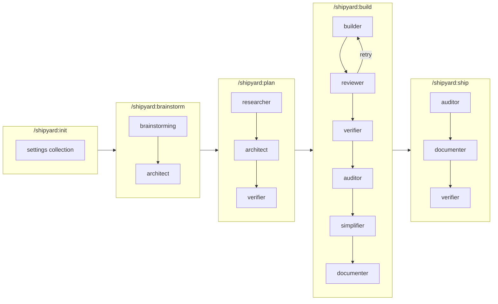

# Shipyard Agent Guide

Complete reference for all Shipyard agents: their roles, model assignments, dispatch patterns, tool access, restrictions, and relationships.

For model routing configuration, see the [Model Routing Protocol](PROTOCOLS.md#model-routing-protocol).

---

## Agent Overview

| Agent | Default Model | Config Key | Dispatched By | Blocking? | Tool Access |
|-------|--------------|------------|---------------|-----------|-------------|
| **architect** | opus | `architecture` | brainstorm, plan, quick | No | Read-only + write plans |
| **builder** | sonnet | `building` | build, quick | Yes (blocks review) | Full (read, write, bash, git) |
| **reviewer** | sonnet | `review` | build, review | Yes (blocks progress) | Read-only |
| **verifier** | haiku | `validation` | plan, build, ship, verify | Yes (gates shipping) | Read + bash (test commands) |
| **auditor** | sonnet | `security_audit` | build, ship, audit | Yes (critical findings block) | Read-only |
| **simplifier** | sonnet | `simplification` | build, simplify | No (advisory) | Read-only |
| **documenter** | sonnet | `documentation` | build, ship, document | No (advisory) | Read + write docs |
| **researcher** | sonnet | `planning` | plan, research | No | Read + web search/fetch |
| **debugger** | sonnet | `debugging` | debug | No | Read + bash (test commands) |
| **mapper** | sonnet | `mapping` | map | No | Read-only |

All model assignments are configurable via `model_routing` in `.shipyard/config.json`. See [Model Selection Guidance](PROTOCOLS.md#model-selection-guidance) for when to upgrade or downgrade.

---

## Pipeline Lifecycle



---

## Individual Agent Details

### architect

- **Model:** opus (configurable via `model_routing.architecture`)
- **Dispatched by:** `/shipyard:brainstorm` (roadmap), `/shipyard:plan` (roadmap + plans), `/shipyard:quick` (quick plans)
- **Recommended max_turns:** 15
- **Inputs:** PROJECT.md, ROADMAP.md, RESEARCH.md, CONTEXT-{N}.md, codebase docs
- **Outputs:** ROADMAP.md (brainstorm), PLAN-{W}.{P}.md (plan)
- **Restrictions:**
  - Maximum 3 tasks per plan
  - Maximum 7 phases per milestone
  - Every task must have a runnable `<verify>` command
  - Done criteria must be observable, not subjective
  - Wave dependency ordering required for parallel execution
- **Why opus:** System decomposition and dependency analysis require the strongest reasoning. Bad plans waste all downstream work.

### builder

- **Model:** sonnet (configurable via `model_routing.building`)
- **Dispatched by:** `/shipyard:build` (per-plan), `/shipyard:quick`
- **Recommended max_turns:** 30
- **Inputs:** PLAN.md, CONVENTIONS.md, prior wave SUMMARY.md files, CONTEXT-{N}.md
- **Outputs:** SUMMARY-{W}.{P}.md, git commits (one per task)
- **Restrictions:**
  - Must follow TDD protocol when `tdd="true"` (test fails before implementation)
  - Must run `<verify>` command for every task before marking done
  - Must not make architectural changes not in the plan
  - Must not combine tasks into a single commit
  - Must not skip tests or verification
  - Stops on `checkpoint:human-verify`, `checkpoint:decision`, `checkpoint:human-action`
  - IaC tasks require additional validation (terraform validate, ansible-lint, hadolint)
- **Fresh context:** Each plan gets a fresh builder agent to prevent context pollution.

### reviewer

- **Model:** sonnet (configurable via `model_routing.review`)
- **Dispatched by:** `/shipyard:build` (after each plan completes), `/shipyard:review` (on-demand)
- **Recommended max_turns:** 15
- **Inputs:** PLAN.md (spec), SUMMARY.md (what was done), git diff (actual changes), CONTEXT-{N}.md
- **Outputs:** REVIEW-{W}.{P}.md
- **Restrictions:**
  - Strict two-stage protocol: Stage 1 (spec compliance) gates Stage 2 (code quality)
  - If Stage 1 fails, Stage 2 is not performed
  - Every PASS must include file path evidence
  - Every finding must include file path, line number, and specific remediation
  - Finding categories: Critical (blocks), Important (should fix), Suggestion (nice-to-have)
  - Non-blocking findings appended to `.shipyard/ISSUES.md`
- **Retry loop:** Critical findings trigger builder re-dispatch (max 2 retries).

### verifier

- **Model:** haiku (configurable via `model_routing.validation`)
- **Dispatched by:** `/shipyard:plan` (plan quality), `/shipyard:build` (phase completion), `/shipyard:ship` (final validation), `/shipyard:verify` (on-demand)
- **Recommended max_turns:** 15
- **Inputs:** ROADMAP.md (success criteria), PLAN.md files (must_haves), test outputs
- **Outputs:** VERIFICATION.md
- **Restrictions:**
  - Must never mark PASS without concrete evidence (test output, file path, command result)
  - Conservative bias: false FAIL > false PASS
  - Must check for regressions in previously passing phases
  - IaC verification requires running validation tools (terraform validate, ansible-lint)
  - MANUAL findings must describe exactly what a human should check
- **Why haiku:** Mechanical task — run commands, check output, compare to criteria. Speed matters more than deep reasoning.

### auditor

- **Model:** sonnet (configurable via `model_routing.security_audit`)
- **Dispatched by:** `/shipyard:build` (after verification), `/shipyard:ship` (mandatory, ignores config), `/shipyard:audit` (on-demand)
- **Recommended max_turns:** 15
- **Inputs:** Git diff of all phase changes, PROJECT.md, CONVENTIONS.md, dependency manifests
- **Outputs:** AUDIT-{N}.md
- **Restrictions:**
  - Critical findings block shipping — phase must not proceed to `/shipyard:ship`
  - Every finding must include file path, line number, and concrete remediation
  - Must reference standards (CWE, OWASP, CIS) where applicable
  - Analyzes 6 areas: code security, secrets, dependencies, IaC, Docker, configuration
  - Cross-task analysis is the unique value — checks component interactions, not individual files
- **Upgrade consideration:** For production codebases handling PII, financial data, or complex auth systems, consider `security_audit: "opus"`.

### simplifier

- **Model:** sonnet (configurable via `model_routing.simplification`)
- **Dispatched by:** `/shipyard:build` (after auditor, unless `--light`), `/shipyard:simplify` (on-demand)
- **Recommended max_turns:** 10
- **Inputs:** Git diff of all phase changes, SUMMARY.md files, PROJECT.md
- **Outputs:** SIMPLIFICATION-{N}.md
- **Restrictions:**
  - Non-blocking — findings are advisory, user decides to implement/defer/dismiss
  - Rule of Three: 2 occurrences = note, 3+ = recommend extraction
  - Must include exact file paths and line numbers for every finding
  - Must not flag test utilities, public API surfaces, or intentionally redundant code
  - Deferred findings appended to `.shipyard/ISSUES.md`
- **Unique value:** Sees the cumulative effect of multiple isolated builder agents — catches duplication, dead code, and AI bloat patterns that per-task reviewers miss.

### documenter

- **Model:** sonnet (configurable via `model_routing.documentation`)
- **Dispatched by:** `/shipyard:build` (after simplifier, unless `--light`), `/shipyard:ship` (comprehensive), `/shipyard:document` (on-demand)
- **Recommended max_turns:** 20
- **Inputs:** Git diff, SUMMARY.md files, PROJECT.md, CONVENTIONS.md, existing docs/
- **Outputs:** DOCUMENTATION-{N}.md (phase), docs/ directory (ship)
- **Restrictions:**
  - Non-blocking — findings are advisory
  - Must update existing docs rather than creating duplicates
  - Document "what" and "why", not "how" (unless logic is complex)
  - Public interfaces only — no over-documenting internal implementation
  - Prioritize examples over prose

### researcher

- **Model:** sonnet (configurable via `model_routing.planning`)
- **Dispatched by:** `/shipyard:plan` (before architect, unless `--skip-research`), `/shipyard:research` (on-demand)
- **Recommended max_turns:** 15
- **Inputs:** STACK.md, ARCHITECTURE.md, ROADMAP.md, codebase (via Grep/Read)
- **Outputs:** RESEARCH.md
- **Restrictions:**
  - Must evaluate at least 3 distinct options for technology choices
  - Must cite sources (URLs) for every factual claim
  - Must check existing codebase before claiming compatibility
  - Must include Uncertainty Flags for inconclusive areas
  - Comparison matrix must use consistent criteria across all candidates
  - Uses WebSearch for breadth, WebFetch for depth, codebase tools for integration analysis

### debugger

- **Model:** sonnet (configurable via `model_routing.debugging`)
- **Dispatched by:** `/shipyard:debug` (on-demand), `/shipyard:build` (optionally, on persistent critical issues)
- **Recommended max_turns:** 20
- **Inputs:** Error description, stack traces, test output, relevant source files, codebase docs
- **Outputs:** ROOT-CAUSE.md
- **Restrictions:**
  - Must complete Phase 1 (root cause investigation) before proposing any fix
  - Must base every conclusion on evidence (logs, code, command output)
  - Must not edit source code — produces a remediation plan for the builder
  - If 3+ hypotheses fail, must flag as potential architectural issue
  - Follows the 5 Whys protocol: ask "Why?" iteratively until reaching a systemic root cause
- **Why sonnet:** Requires tracing data flow and reading code carefully. Opus is available via config upgrade for complex multi-component failures.

### mapper

- **Model:** sonnet (configurable via `model_routing.mapping`)
- **Dispatched by:** `/shipyard:map` (on-demand, supports all 4 focus areas in parallel)
- **Recommended max_turns:** 20
- **Inputs:** Entire codebase (read-only)
- **Outputs:** One of: STACK.md + INTEGRATIONS.md, ARCHITECTURE.md + STRUCTURE.md, CONVENTIONS.md + TESTING.md, or CONCERNS.md
- **Restrictions:**
  - Assigned one of 4 focus areas: technology, architecture, quality, concerns
  - Every finding must cite at least one file path as evidence
  - Must sample 2-3 files per module (no generalizing from single files)
  - Must flag uncertainty with `[Inferred]` marker
  - Each document must be independently useful
- **Parallel dispatch:** `/shipyard:map` runs 4 mapper instances concurrently, each with a different focus area.

---

## Agent Communication

Agents **do not communicate directly** with each other. All information exchange happens through artifacts:

| Producer | Artifact | Consumer(s) |
|----------|----------|-------------|
| Mapper | STACK.md, ARCHITECTURE.md, etc. | Architect, Builder |
| Researcher | RESEARCH.md | Architect |
| Architect | ROADMAP.md, PLAN.md | Builder, Reviewer, Verifier |
| Builder | SUMMARY.md, git commits | Reviewer, Verifier, Auditor, Simplifier, Documenter |
| Reviewer | REVIEW.md | Builder (on retry), Orchestrator |
| Verifier | VERIFICATION.md | Orchestrator |
| Auditor | AUDIT.md | Orchestrator |
| Simplifier | SIMPLIFICATION.md | Orchestrator |
| Documenter | DOCUMENTATION.md, docs/ | Orchestrator |

The **orchestrator** (the main Claude session) manages all agent dispatch and reads all artifacts. Each agent dispatch gets fresh context — no agent has memory of previous dispatches.

---

## Blocking vs Advisory

**Blocking agents** can halt pipeline progress:
- **builder** — must complete before reviewer runs
- **reviewer** — Critical findings trigger builder retry (max 2 cycles); persistent failures mark plan as `needs_attention`
- **verifier** — FAIL verdict prevents phase from being marked complete
- **auditor** — Critical findings block `/shipyard:ship`

**Advisory agents** produce reports but don't halt progress:
- **simplifier** — user decides: implement, defer, or dismiss
- **documenter** — user decides: generate, defer, or dismiss
- **researcher** — informs architect but doesn't gate planning
- **architect** — produces plans for user approval
- **debugger** — produces ROOT-CAUSE.md with remediation plan for builder
- **mapper** — produces documentation for reference

---

## Common Agent Compositions

Named workflows showing which agents work together for common scenarios. Use these as recipes when composing agent pipelines.

### Full Build Pipeline
```
researcher → architect → [builder → reviewer]* → verifier → auditor → simplifier → documenter
```
Standard `/shipyard:build` flow. The `[builder → reviewer]*` loop repeats up to 2 retries on critical findings. Auditor, simplifier, and documenter run after phase verification.

### Quick Task
```
architect → builder
```
Simplified `/shipyard:quick` flow. Architect produces a lightweight plan (max 3 steps), builder executes it. No review gate.

### Investigation
```
debugger → builder → reviewer → verifier
```
Bug fix with root-cause analysis. Debugger produces diagnosis and remediation plan. Builder implements the fix. Reviewer and verifier confirm correctness.

### Brownfield Onboarding
```
mapper(×4, parallel) → architect → researcher
```
Understand an existing codebase before planning. Four mapper instances run in parallel (technology, architecture, quality, concerns), producing codebase docs. Architect and researcher use those docs for informed planning.

### Code Quality Audit
```
reviewer + auditor + simplifier (parallel)
```
On-demand quality check without building. All three agents run in parallel against the current diff or phase changes. Useful before shipping or after large refactors.

### Planning Pipeline
```
researcher → architect → verifier
```
Standard `/shipyard:plan` flow. Researcher investigates the domain, architect decomposes into plans, verifier checks plan quality and coverage.
