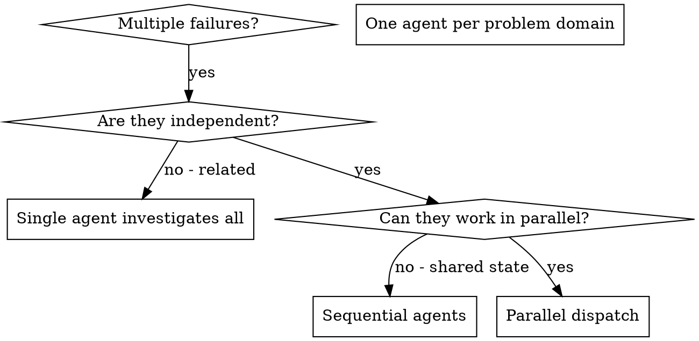

<!-- TOKEN BUDGET: 220 lines / ~660 tokens -->

# Dispatching Parallel Agents

<activation>

## When to Use

- 2+ independent tasks that can be worked on without shared state or sequential dependencies
- 3+ test files failing with different root causes
- Multiple subsystems broken independently
- Each problem can be understood without context from others
- Multiple independent plan tasks can run concurrently

## When NOT to Use

- Failures are related (fix one might fix others) -- investigate together first
- Need to understand full system state before acting
- Agents would interfere with each other (editing same files, using same resources)
- Exploratory debugging where you don't know what's broken yet

### Teams vs Subagents

When Claude Code Agent Teams is enabled (`SHIPYARD_TEAMS_ENABLED=true`):

- **Teammates** are independent Claude Code instances with their own context windows. They share a task list and mailbox but NOT your conversation history.
- **Subagents** (Task tool) are spawned within your session. They share your working directory but have fresh context.

**Use teammates when:** Tasks are truly independent, each takes significant time (>5 min), and isolation prevents cross-contamination.
**Use subagents when:** Tasks need results fed back into your current context, or when coordination is tight (same files, dependent changes).

When teams are NOT enabled, this section has no effect — use subagents as normal.

## Natural Language Triggers
- "run in parallel", "do these at the same time", "parallel tasks", "concurrent agents"

</activation>

## Overview

When you have multiple unrelated failures (different test files, different subsystems, different bugs), investigating them sequentially wastes time. Each investigation is independent and can happen in parallel.

**Core principle:** Dispatch one agent per independent problem domain. Let them work concurrently.

## Decision Flow



<instructions>

## The Pattern

### 1. Identify Independent Domains

Group failures by what's broken:
- File A tests: Tool approval flow
- File B tests: Batch completion behavior
- File C tests: Abort functionality

Each domain is independent -- fixing tool approval doesn't affect abort tests.

### 2. Create Focused Agent Tasks

Each agent gets:
- **Specific scope:** One test file or subsystem
- **Clear goal:** Make these tests pass
- **Constraints:** Don't change other code
- **Expected output:** Summary of what you found and fixed

### 3. Dispatch in Parallel

```typescript
// In Claude Code / AI environment
Task("Fix agent-tool-abort.test.ts failures")
Task("Fix batch-completion-behavior.test.ts failures")
Task("Fix tool-approval-race-conditions.test.ts failures")
// All three run concurrently
```

### 4. Review and Integrate

When agents return:
- Read each summary
- Verify fixes don't conflict
- Run full test suite
- Integrate all changes

## Agent Prompt Structure

Good agent prompts are:
1. **Focused** -- One clear problem domain
2. **Self-contained** -- All context needed to understand the problem
3. **Specific about output** -- What should the agent return?

```markdown
Fix the 3 failing tests in src/agents/agent-tool-abort.test.ts:

1. "should abort tool with partial output capture" - expects 'interrupted at' in message
2. "should handle mixed completed and aborted tools" - fast tool aborted instead of completed
3. "should properly track pendingToolCount" - expects 3 results but gets 0

These are timing/race condition issues. Your task:

1. Read the test file and understand what each test verifies
2. Identify root cause - timing issues or actual bugs?
3. Fix by:
   - Replacing arbitrary timeouts with event-based waiting
   - Fixing bugs in abort implementation if found
   - Adjusting test expectations if testing changed behavior

Do NOT just increase timeouts - find the real issue.

Return: Summary of what you found and what you fixed.
```

</instructions>

<rules>

## Common Mistakes

**Too broad:** "Fix all the tests" -- agent gets lost
**Specific:** "Fix agent-tool-abort.test.ts" -- focused scope

**No context:** "Fix the race condition" -- agent doesn't know where
**Context:** Paste the error messages and test names

**No constraints:** Agent might refactor everything
**Constraints:** "Do NOT change production code" or "Fix tests only"

**Vague output:** "Fix it" -- you don't know what changed
**Specific:** "Return summary of root cause and changes"

</rules>

<examples>

## Parallel Dispatch Examples

### Good: Independent tasks dispatched in parallel

**Scenario:** 6 test failures across 3 files after major refactoring.

Analysis: Abort logic, batch completion, and race condition handling are separate subsystems with no shared code paths. Fixing one cannot fix or break another.

```
Agent 1 -> Fix agent-tool-abort.test.ts (3 timing failures)
Agent 2 -> Fix batch-completion-behavior.test.ts (2 event structure failures)
Agent 3 -> Fix tool-approval-race-conditions.test.ts (1 async failure)
```

Result: All three agents return independently. Fixes don't conflict. Full suite green after integration.

### Bad: Dependent tasks dispatched in parallel

**Scenario:** Auth module refactored. Login tests fail, and downstream API tests also fail because they depend on the auth module.

```
Agent 1 -> Fix login.test.ts failures
Agent 2 -> Fix api-protected-routes.test.ts failures
```

Why this fails: Agent 2 cannot succeed until Agent 1 fixes the auth module. The API route failures are a symptom of the auth bug, not independent problems. Agent 2 will either duplicate Agent 1's fix (conflict) or fail entirely.

**Correct approach:** Fix auth first (single agent), then assess whether API route failures remain.

### Bad: Shared file creates conflicts

**Scenario:** Two agents both need to modify `src/config.ts` to fix their respective issues.

```
Agent 1 -> Fix database connection pooling (needs to change config.ts)
Agent 2 -> Fix cache TTL settings (needs to change config.ts)
```

Why this fails: Both agents will edit the same file. Their changes will conflict during integration. Run these sequentially instead.

</examples>

## Verification

After agents return:
1. **Review each summary** -- Understand what changed
2. **Check for conflicts** -- Did agents edit same code?
3. **Run full suite** -- Verify all fixes work together
4. **Spot check** -- Agents can make systematic errors
